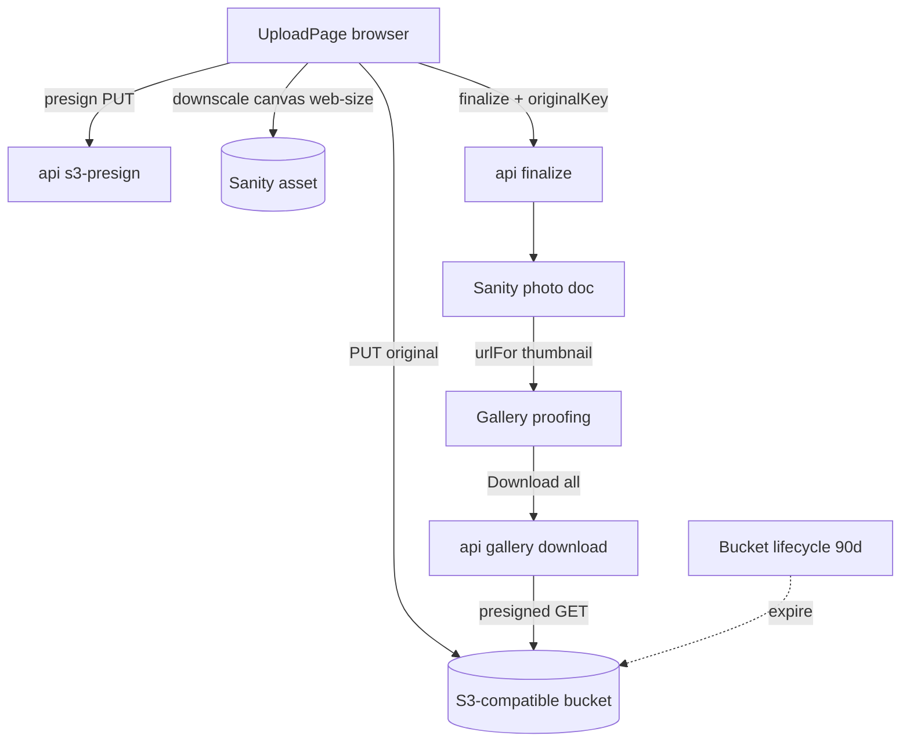

# Requirements

### Overview & Goals

Dua workstream (dipilih user) untuk meningkatkan YLx — platform proofing/distribusi foto ke client (bukan tampilan live tamu):

1. **Quick-win performa (dalam repo)** — pangkas round-trip & payload di jalur baca admin dan galeri, tanpa layanan baru.
2. **Arsip original ke object storage S3-compatible (provider-agnostik)** — pindahkan penyimpanan original full-res keluar dari Sanity untuk menekan biaya storage/bandwidth Sanity, dengan pola **dual-write** (original→S3, turunan web-size→Sanity), plus **download semua foto** untuk client dan **notifikasi retensi 3 bulan**.

### Scope

**In scope (apps/web + packages):**
- Perf: gabung dua query detail album jadi satu; read-client ber-CDN untuk daftar album; pagination/virtualization grid galeri.
- Storage: klien S3-compatible provider-agnostik (endpoint konfigurabel), endpoint presigned PUT (upload) + presigned GET (download), field `originalKey` di skema `photo`.
- Upload dual-write: browser unggah original→S3 + turunan web-size→Sanity; `finalize` simpan keduanya.
- Delivery: "Download all" (semua foto album) di galeri + banner retensi 3 bulan; lifecycle expiry di bucket.

**Out of scope:**
- Watch-folder/CLI auto-upload (ditunda, proyek terpisah).
- Migrasi original lama yang sudah terlanjur tersimpan di Sanity (opsional, dicatat sebagai follow-up).
- Cloudinary / transform eksternal — dual-write tetap memakai pipeline `urlFor` Sanity untuk thumbnail proofing.

### User Stories

- Sebagai **fotografer**, saya ingin biaya storage Sanity turun karena original full-res diarsipkan murah di object storage S3-compatible pilihan saya (tak harus AWS).
- Sebagai **client**, saya ingin **mengunduh semua foto** album saya, dan diberi tahu album hanya tersedia **3 bulan** agar saya segera menyimpan file.
- Sebagai **admin/klien**, saya ingin galeri & dashboard tetap cepat pada album besar (ratusan foto) tanpa jank.

### Functional Requirements / Acceptance Criteria

- **Perf-1:** detail album memakai **satu** query (subquery `selections` yang tadinya diabaikan dipakai, fetch kedua dihapus).
- **Perf-2:** daftar album dibaca via client **`useCdn: true`** terpisah; jalur read-after-write tetap `useCdn:false`.
- **Perf-3:** grid galeri tidak lagi merender semua foto sekaligus (windowing/paginasi) — album besar tetap mulus.
- **Store-1:** upload menulis original full-res ke bucket S3-compatible dan turunan web-size ke Sanity; `photo.originalKey` terisi.
- **Store-2:** endpoint presigned provider-agnostik (endpoint/region/bucket dari env), `requireAdmin` untuk upload.
- **Deliv-1:** galeri punya "Download all" yang mengunduh seluruh foto album via presigned GET (di-gate PIN).
- **Deliv-2:** banner retensi "Album hanya tersedia 3 bulan — harap unduh semua file" tampil dengan tanggal kedaluwarsa terhitung.

### Non-Functional Requirements

- Tanpa regresi fungsional; pipeline hijau (tsc, eslint, vitest, Playwright, build).
- Provider-agnostik: bekerja dengan AWS S3 / Cloudflare R2 / Backblaze B2 / MinIO / Wasabi via `@aws-sdk/client-s3` + endpoint kustom.
- Keamanan: kredensial S3 hanya di server (env), presigned URL berdurasi pendek; kredensial tak pernah ke browser.

# Technical Design

### Current Implementation

- **Upload (direct-to-Sanity):** browser ambil `GET /api/admin/upload/credentials` (`requireAdmin`, `no-store`) → unggah biner langsung ke Sanity Asset API (lewati batas ~4.5MB Vercel) → `POST /api/admin/upload/finalize` (create `photo` + `patch(album).append("photos", …)` retry-409 + `publishAdminEvent`). File: `credentials.ts`, `finalize.ts:96-140`.
- **Sanity client:** `packages/sanity/client.ts` — `sanityClient` & `sanityWriteClient` keduanya `useCdn:false`; `urlFor` builder untuk transform on-the-fly.
- **Detail album (admin):** `packages/sanity/lib/queries.ts:55` sudah menghitung subquery `selections`, tetapi `apps/web/src/pages/api/admin/albums/[id]/index.ts:78` mengabaikannya dan menembak query kedua `selectionsByAlbumQuery` → 2 round-trip + subquery mubazir.
- **Galeri:** `GalleryPage.tsx:193-233` merender SEMUA foto (`motion.div` per item); `verify.ts:114-145` mengirim seluruh foto dalam satu payload.
- **Skema `photo`:** kini `filename` + `image`(asset ref) + `album` ref; belum ada field original eksternal. Tipe bersama `Photo` (`packages/shared/types/photo.ts`) punya `url/thumbnailUrl/thumbnailSrcSet/lqip`.
- **Greenfield cloud:** tak ada dependency `@aws-sdk/*`/`cloudinary`/`googleapis` (terverifikasi).
- **Provider S3-compatible sudah tersedia (dikonfirmasi user):** endpoint `https://eu-central-2.storage.impossibleapi.net`, region `eu-central-2`, bucket `ylx`; access/secret key akan diset sebagai env server (`S3_ENDPOINT`/`S3_REGION`/`S3_BUCKET`/`S3_ACCESS_KEY_ID`/`S3_SECRET_ACCESS_KEY`), tidak pernah ditulis mentah di kode/dok. (Catatan: sempat dieksplorasi gateway kustom milik user, `9Drive` self-hosted di `backend.ylex.my.id` — **tidak dipakai**; user memutuskan langsung ke S3-compatible ini.)

### Key Decisions

- **Dual-write (pilihan user).** Original full-res → bucket S3-compatible; turunan web-size (≤2000px JPEG) → Sanity untuk thumbnail proofing. Ini yang benar-benar menurunkan storage Sanity, bukan sekadar mirror.
- **Downscale di browser.** Browser sudah memegang file original → buat turunan web-size via `<canvas>` sebelum unggah ke Sanity; original diunggah ke S3 via presigned PUT (keduanya langsung dari browser, lewati 4.5MB). Payload `finalize` tetap JSON kecil.
- **Provider-agnostik, provider sudah ditentukan.** `@aws-sdk/client-s3` + `@aws-sdk/s3-request-presigner` dengan `endpoint`/`region`/`forcePathStyle` dari env → tetap generik (dukung AWS S3/R2/B2/MinIO/Wasabi), tapi konfigurasi awal langsung memakai endpoint ImpossibleAPI (`eu-central-2.storage.impossibleapi.net`, bucket `ylx`) yang sudah disediakan user; `forcePathStyle: true` kemungkinan diperlukan untuk endpoint custom non-AWS ini (diverifikasi saat implementasi).
- **Delivery = semua foto (pilihan user).** Endpoint galeri (di-gate PIN) kembalikan daftar presigned GET seluruh original album; UI "Download all" mengunduh berurutan. Hindari ZIP di serverless (batas memori/timeout Vercel untuk data GB).
- **Retensi 3 bulan.** Kedaluwarsa = `album._createdAt + 90 hari`; ditegakkan lewat lifecycle rule bucket (auto-expire) + banner peringatan; tak ada auto-delete di kode app.
- **Perf minim-risiko.** Gabung query + `useCdn` untuk list + windowing galeri; tanpa mengubah kontrak API publik.

### Proposed Changes

1. **Perf** — `queries.ts`/`[id]/index.ts`: satukan query detail album (buang fetch kedua `selectionsByAlbumQuery`, pakai subquery yang sudah ada). `client.ts`: tambah `sanityCdnClient` (`useCdn:true`) untuk `allAlbumsQuery`. `GalleryPage.tsx`: windowing/infinite-scroll (mis. paginasi in-memory + `IntersectionObserver`, atau `react-window`).
2. **Storage foundation** — `apps/web/src/lib/storage.ts` (klien S3 dari env + presign helper); skema Sanity `photo` tambah `originalKey: string`; tipe `Photo` tambah `originalKey?`. Endpoint `POST /api/admin/upload/s3-presign` (PUT, `requireAdmin`).
3. **Dual-write upload** — `UploadPage.tsx`: minta presign S3 → PUT original ke bucket; downscale `<canvas>` → unggah turunan web-size ke Sanity; `finalize.ts` diperluas menerima `originalKey` dan menyimpannya ke doc `photo`.
4. **Delivery + retensi** — `GET /api/gallery/[slug]/download` (verifikasi PIN) → daftar presigned GET semua original; `GalleryPage` tombol "Download all" (unduh berurutan) + banner retensi dengan tanggal kedaluwarsa (`_createdAt + 90d`). Lifecycle rule bucket + env didokumentasikan di STATUS/README/`.env.local.example`.

### Data Models / Contracts

- `photo` (Sanity): `+ originalKey: string` (key objek di bucket).
- `Photo` (shared): `+ originalKey?: string`.
- `POST /api/admin/upload/s3-presign` → `{ key, url, headers }` (PUT presigned, TTL pendek, `requireAdmin`).
- `GET /api/gallery/[slug]/download` (+PIN) → `{ files: { filename, url }[] }` (GET presigned).

### File Structure

- `apps/web/src/lib/storage.ts` — klien S3 + presign helper (baru)
- `apps/web/src/pages/api/admin/upload/s3-presign.ts` — presign PUT (baru)
- `apps/web/src/pages/api/gallery/[slug]/download.ts` — presign GET semua foto (baru)
- `apps/web/src/pages/api/admin/upload/finalize.ts` — terima `originalKey` (M)
- `apps/web/src/components/admin/UploadPage.tsx` — dual-write + downscale (M)
- `apps/web/src/components/gallery/GalleryPage.tsx` — windowing + Download all + banner retensi (M)
- `apps/web/src/pages/api/admin/albums/[id]/index.ts`, `packages/sanity/lib/queries.ts` — gabung query (M)
- `packages/sanity/client.ts` — `sanityCdnClient` (M)
- `packages/sanity/schemas/photo.*`, `packages/shared/types/photo.ts` — `originalKey` (M)
- `apps/web/.env.local.example`, `STATUS.md`, `README.md`, `PROGRESS.md` — env S3 + retensi (M)

### Architecture Diagram

### Risks

- **Batas serverless untuk ZIP** → dihindari dengan presigned GET per-file (unduh berurutan), bukan ZIP di Vercel.
- **CORS bucket** → bucket harus mengizinkan origin app untuk PUT/GET dari browser (didokumentasikan seperti CORS Sanity).
- **Downscale di browser** bisa berat untuk banyak foto → batasi concurrency (pola `UPLOAD_CONCURRENCY=3` yang ada) + fallback bila `<canvas>` gagal.
- **Auto-expire 90 hari** menghapus original → banner peringatan wajib + (opsional) pengingat; pastikan client sadar.
- **Migrasi original lama** (yang sudah di Sanity) di luar scope → catat sebagai follow-up bila ingin hemat penuh.

# Testing

### Validation Approach

Gabungan uji unit/integrasi + E2E + verifikasi manual jalur storage (butuh bucket uji), tanpa regresi pipeline repo.

- `pnpm exec tsc --noEmit`
- `pnpm exec eslint src --max-warnings 0`
- `pnpm exec vitest`
- `pnpm exec playwright test` — admin + gallery + upload
- `pnpm build`
- Verifikasi manual/preview: upload nyata (bisa memakai foto asli yang sudah user siapkan untuk pengujian) → cek original ada di bucket + turunan web-size di Sanity + `photo.originalKey` terisi; "Download all" mengunduh semua file; banner retensi tampil.

### Key Scenarios

- **Perf query:** buka detail album → hanya satu request Sanity (bukan dua); data selections tetap lengkap.
- **Perf list:** daftar album terbaca via CDN client; tak ada regresi konten.
- **Perf galeri:** album besar (ratusan foto) → grid ter-window, scroll mulus, tak render semua sekaligus.
- **Dual-write:** upload 1 foto → original di bucket, turunan web-size jadi thumbnail proofing, `originalKey` tersimpan.
- **Download all:** client (pasca-PIN) mengunduh seluruh original album via presigned GET.
- **Retensi:** banner menampilkan tanggal kedaluwarsa = `_createdAt + 90 hari`.

### Edge Cases

- Presign gagal / kredensial S3 tak lengkap → error jelas, tidak crash; upload tak setengah jalan tanpa `originalKey`.
- CORS bucket belum diset → pesan gagal terang (bukan diam).
- `<canvas>` downscale gagal (format aneh) → fallback (skip/re-try) tanpa menggantung batch.
- File original hilang/expired saat "Download all" → tandai file yang gagal, lanjutkan sisanya.
- Endpoint download tetap di-gate PIN (tanpa PIN valid → 401).

### Test Changes

- Tambah unit test util `storage.ts` (pembentukan key + presign) dengan env dummy.
- Perluas `tests/upload.spec.ts`: assert `finalize` menerima `originalKey`; mock presign S3.
- Tambah test galeri untuk tombol "Download all" + banner retensi.
- Verifikasi E2E final di preview (agent-browser + Kernel) dengan `test-foto.JPG` seperti pass sebelumnya.

# Delivery Steps

###   Step 1: Perf — gabung query detail album + read-client CDN
Detail album memakai satu query dan daftar album dibaca via CDN, tanpa regresi data.

- `apps/web/src/pages/api/admin/albums/[id]/index.ts`: pakai subquery `selections` yang sudah ada di `albumWithSelectionsQuery` (`packages/sanity/lib/queries.ts:55`) dan **hapus fetch kedua** `selectionsByAlbumQuery`.
- `packages/sanity/client.ts`: tambah `sanityCdnClient` (`useCdn:true`); pakai untuk `allAlbumsQuery` (list), pertahankan `useCdn:false` untuk read-after-write.
- Verifikasi detail & list album tetap benar (selections lengkap, tanpa regresi).

###   Step 2: Perf — windowing/pagination grid galeri
Album besar tetap mulus tanpa merender semua foto sekaligus.

- Terapkan windowing/infinite-scroll di `GalleryPage.tsx` (paginasi in-memory + `IntersectionObserver`, atau `react-window`).
- Batasi stagger animasi hanya untuk viewport pertama.
- Pastikan seleksi & lightbox tetap berfungsi pada daftar ter-window.

###   Step 3: Storage foundation — klien S3 provider-agnostik + skema + presign
Ada fondasi object storage yang bisa dipakai upload & download.

- Buat `apps/web/src/lib/storage.ts`: klien `@aws-sdk/client-s3` dari env (`S3_ENDPOINT`/`S3_REGION`/`S3_BUCKET`/`S3_ACCESS_KEY_ID`/`S3_SECRET_ACCESS_KEY`/`forcePathStyle`) + helper presign PUT/GET (`@aws-sdk/s3-request-presigner`); default env values merujuk provider ImpossibleAPI yang sudah disediakan user (endpoint `eu-central-2.storage.impossibleapi.net`, bucket `ylx`), tanpa hardcode kredensial di kode.
- Tambah field `originalKey` ke skema `photo` (`packages/sanity`) dan `originalKey?` ke tipe `Photo` (`packages/shared`).
- Endpoint `POST /api/admin/upload/s3-presign` (`requireAdmin`) → presigned PUT `{ key, url, headers }`.
- Dokumentasikan env baru di `apps/web/.env.local.example` + catatan CORS bucket (perlu di-set di dashboard provider ImpossibleAPI agar origin app diizinkan PUT/GET dari browser).

###   Step 4: Dual-write upload
Upload menyimpan original ke bucket dan turunan web-size ke Sanity.

- `UploadPage.tsx`: minta presign S3 → PUT original ke bucket; buat turunan web-size via `<canvas>` (≤2000px) → unggah ke Sanity (jalur asset existing); pertahankan concurrency + retry.
- Perluas `finalize.ts` menerima `originalKey` dan menyimpannya ke doc `photo` (validasi input, tetap `requireAdmin`).
- Uji: original ada di bucket, thumbnail proofing dari turunan, `originalKey` terisi.

###   Step 5: Delivery "Download all" + banner retensi 3 bulan
Client bisa mengunduh semua foto dan tahu batas 3 bulan.

- Endpoint `GET /api/gallery/[slug]/download` (verifikasi PIN, reuse `pinMatches`) → daftar presigned GET seluruh original album `{ filename, url }[]`.
- `GalleryPage.tsx`: tombol "Download all" (unduh berurutan, tandai yang gagal) + banner retensi menampilkan tanggal kedaluwarsa (`album._createdAt + 90 hari`).
- Dokumentasikan lifecycle rule bucket (auto-expire 90d) di `STATUS.md`/`README.md`; jalankan pipeline penuh (tsc, eslint, vitest, Playwright, build) sebagai gate akhir.