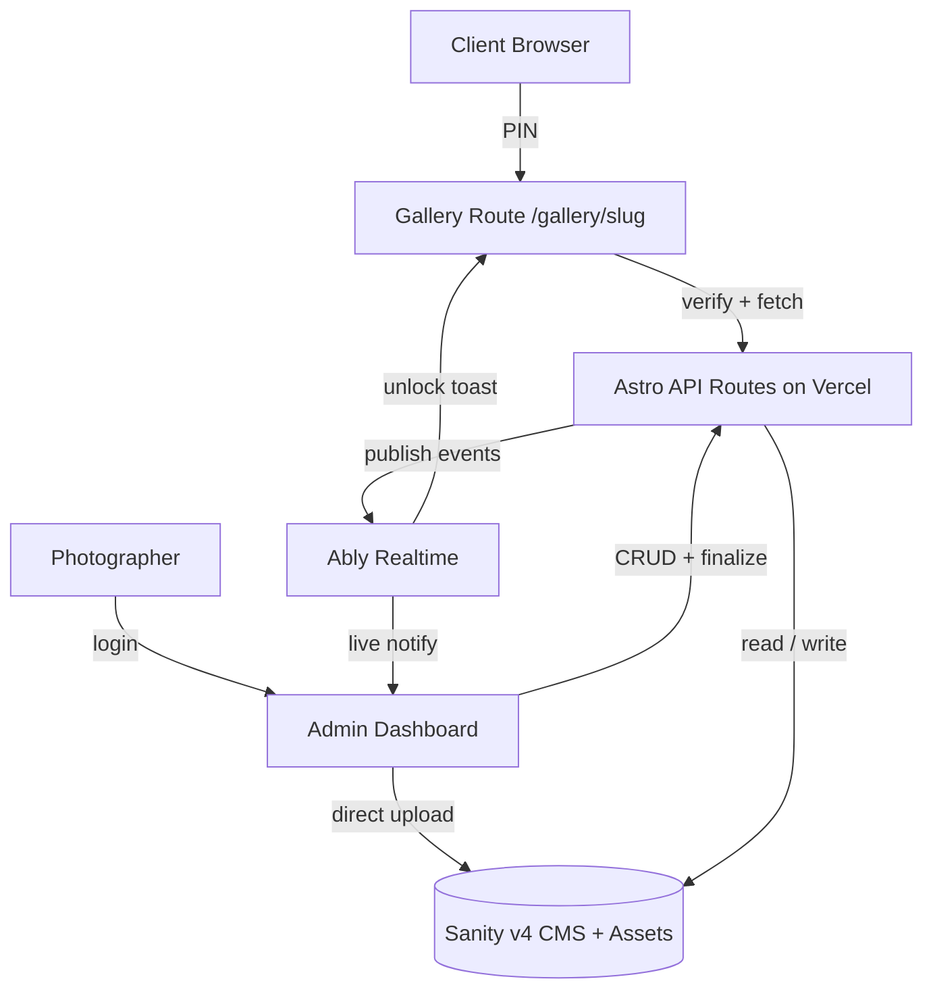
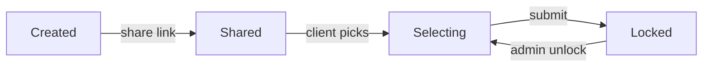

<!-- ═══════════════════════════ HEADER ═══════════════════════════ -->
<div align="center">


<a href="https://ylex.my.id">
  
</a>

<br/>

<!-- Tech badges -->
<p>
  
  
  
  
  
  
</p>

<!-- Status badges -->
<p>
  
  
  
  
  
</p>

<p>
  <a href="https://ylex.my.id"><b>🌐 Live Demo</b></a> &nbsp;•&nbsp;
  <a href="#-features"><b>✨ Features</b></a> &nbsp;•&nbsp;
  <a href="#-architecture"><b>🏗 Architecture</b></a> &nbsp;•&nbsp;
  <a href="#-quick-start"><b>🚀 Quick Start</b></a> &nbsp;•&nbsp;
  <a href="#-project-structure"><b>🗂 Structure</b></a>
</p>

</div>

<!-- ═══════════════════════════ ABOUT ═══════════════════════════ -->

## 📖 About

**YLx** is a full-stack **photo proofing gallery platform** built for wedding photographers.
It replaces manual file-sharing, endless email threads, and messy spreadsheet tracking with a single, beautifully branded workflow:

> **Photographer uploads → Client selects via a PIN-locked gallery → Photographer exports the chosen filenames straight to Lightroom.**

The experience is **dark, warm, and mobile-first** — photos are the hero, the UI stays out of the way.

<div align="center">
  
  
  
</div>

---

<!-- ═══════════════════════════ FEATURES ═══════════════════════════ -->

## ✨ Features

| | Feature | Details |
|---|---|---|
| 🖼️ | **Direct-to-Sanity upload** | Binaries stream straight from the browser to the Sanity Asset API — bypassing Vercel's ~4.5 MB body limit. Bounded concurrency (`3×`) + auto-retry with exponential backoff. |
| 🔐 | **PIN-locked galleries** | Each album is gated by a PIN, validated server-side with `crypto.timingSafeEqual`. Rate-limited per-IP **and** per-album, **fail-closed** in production. |
| ✅ | **Client selection flow** | Clients pick favorites within a configurable max, from the grid or inside a fullscreen lightbox, then submit. |
| 🔒 | **Album lifecycle** | `active → submitted → locked`, with admin **manual lock / unlock** (unlock clears old selections for a resubmit). |
| ⚡ | **Realtime updates** | Ably powers live admin notifications on submit/unlock and animated client toasts — no refresh needed. |
| 📋 | **Lightroom export** | One-click **copy original filenames** (comma-separated) for a frictionless editing handoff. |
| 🎛️ | **Admin dashboard** | Search, status filters, pagination, bulk album/photo delete, drag & keyboard photo reorder — all mobile-first. |
| 🌫️ | **LQIP blur-up** | Progressive image loading with low-quality placeholders in both grid and lightbox. |
| ♿ | **Accessible by default** | Focus traps, `role="alert"` live regions, `:focus-visible`, `prefers-reduced-motion`, ≥44px touch targets. |

---

<!-- ═══════════════════════════ TECH STACK ═══════════════════════════ -->

## 🧰 Tech Stack

<div align="center">

| Layer | Technology |
|-------|-----------|
| **Frontend** | Astro 5 (islands) + React 18 (`client:load` / `client:idle`) |
| **CMS + DB** | Sanity v4 — *all* data lives here (no Prisma) |
| **Auth** | Email + bcrypt (12 rounds), HMAC-signed session cookie |
| **Realtime** | Ably (`publishAdminEvent` server-side, `useRealtime` / `useAdminRealtime` client-side) |
| **Rate limiting** | Upstash Redis (fail-closed in prod; in-memory fallback for dev) |
| **Motion** | Framer Motion |
| **Deployment** | Vercel Serverless (`@astrojs/vercel` v8, Node 22) |
| **Monorepo** | Turborepo + pnpm workspaces |

</div>

---

<!-- ═══════════════════════════ ARCHITECTURE ═══════════════════════════ -->

## 🏗 Architecture



**Album lifecycle**



---

<!-- ═══════════════════════════ QUICK START ═══════════════════════════ -->

## 🚀 Quick Start

```bash
# 1. Clone
git clone https://github.com/msph1973/ylx.git
cd ylx

# 2. Install (pnpm workspace)
pnpm install

# 3. Configure env — see the section below
cp apps/web/.env.local.example apps/web/.env.local   # then fill in the values

# 4. Run the dev server
pnpm dev            # turbo dev → Astro on http://localhost:4321
```

### Useful scripts

```bash
pnpm build          # turbo build (all workspaces)
pnpm lint           # turbo lint
pnpm test           # vitest unit tests
pnpm exec tsc --noEmit                      # strict type-check
pnpm exec eslint src --max-warnings 0       # zero-warning lint gate
pnpm exec playwright test                   # E2E (needs a live server + seed)
```

> **Quality gate:** run `tsc --noEmit` and `eslint --max-warnings 0` before every commit.

---

<!-- ═══════════════════════════ ENV ═══════════════════════════ -->

## 🔑 Environment Variables

Copy `apps/web/.env.local.example` → `apps/web/.env.local` and fill in the values:

```env
# Sanity (public — safe for client-side)
PUBLIC_SANITY_PROJECT_ID=
PUBLIC_SANITY_DATASET=production

# Ably (subscribe-only key for client-side)
PUBLIC_ABLY_KEY=

# --- Server-side only (never exposed to the browser) ---

# Sanity server token. Needs the Editor/write role — reads keep working on a
# private dataset AND it powers direct-to-Sanity upload.
SANITY_API_TOKEN=

# Ably full key — server-side publish + token minting
ABLY_API_KEY=

# HMAC secret for signing the admin session cookie
SESSION_SECRET=

# Upstash Redis (REST) — required in production; the gallery PIN rate limiter
# fails closed (rejects all PIN attempts) if unset. Local dev falls back to a
# per-instance in-memory limiter.
UPSTASH_REDIS_REST_URL=
UPSTASH_REDIS_REST_TOKEN=
```

> ⚠️ **Direct-to-Sanity upload** requires the app origin (production **and** preview) to be added to **Sanity → API → CORS origins**, and `SANITY_API_TOKEN` to have the **Editor/write** role.

---

<!-- ═══════════════════════════ STRUCTURE ═══════════════════════════ -->

## 🗂 Project Structure

```
ylx/
├── apps/
│   └── web/                      # Astro 5 + React app (Vercel rootDirectory)
│       └── src/
│           ├── pages/
│           │   ├── index.astro           # Homepage + gallery entry form
│           │   ├── admin/                 # Login, dashboard, upload
│           │   ├── gallery/[slug].astro   # PIN-locked gallery route
│           │   └── api/                   # Serverless API routes
│           │       ├── admin/             # albums, photos, upload (credentials + finalize)
│           │       ├── gallery/[slug]/    # verify (PIN), submit
│           │       └── auth/              # login, logout, create-admin
│           ├── components/
│           │   ├── admin/                 # Dashboard, AlbumDetail, UploadPage, SelectionTable…
│           │   └── gallery/               # GalleryPage, PinEntry, PhotoLightbox, BlurImage (LQIP)
│           ├── hooks/                     # useCopyToClipboard, useFocusTrap, realtime hooks
│           └── lib/                       # auth, slug, ably, albumStatus, albumDeletion, ratelimit
├── packages/
│   ├── sanity/                   # Schemas (album, photo, selection) + GROQ queries + admin helpers
│   └── shared/                   # Shared types (Album, Photo, Selection) + utils
├── docs/                         # Feature docs (admin dashboard, direct-sanity-upload…)
├── scripts/                      # CLI utilities (e.g. seed-admin)
└── STATUS.md / DESIGN.md / …     # Living project documentation
```

---

<!-- ═══════════════════════════ KEY CONCEPTS ═══════════════════════════ -->

## 🧭 Key Concepts

- **Gallery route** — `/gallery/[album-slug]`, PIN validated at `api/gallery/[slug]/verify.ts`.
- **Slug** — auto-generated from the album title (`src/lib/slug.ts`), collision-safe with a timestamp suffix.
- **Non-negotiable rules** — TypeScript strict (no `any`); every admin API route calls `requireAdmin(cookies)` first; `publishAdminEvent()` after every state-changing action.
- **Docs first** — read [`STATUS.md`](./STATUS.md) (source of truth), then [`REVIEW.md`](./REVIEW.md) and [`DESIGN.md`](./DESIGN.md).

---

<!-- ═══════════════════════════ SECURITY ═══════════════════════════ -->

## 🛡 Security Highlights

- bcrypt (12 rounds) + HMAC-signed, `httpOnly`, `secure` (prod) session cookie.
- `requireAdmin()` guards every admin endpoint; single generic login error (no user enumeration).
- Gallery PIN: per-IP + per-album rate limiting, `timingSafeEqual`, fail-closed on Upstash outage.
- Private Sanity dataset; `.git` / `.env` blocked at the Vercel edge; no hardcoded credentials.

---

<div align="center">


<sub>Built with ♥ for photographers · <a href="https://ylex.my.id">ylex.my.id</a></sub>

</div>
